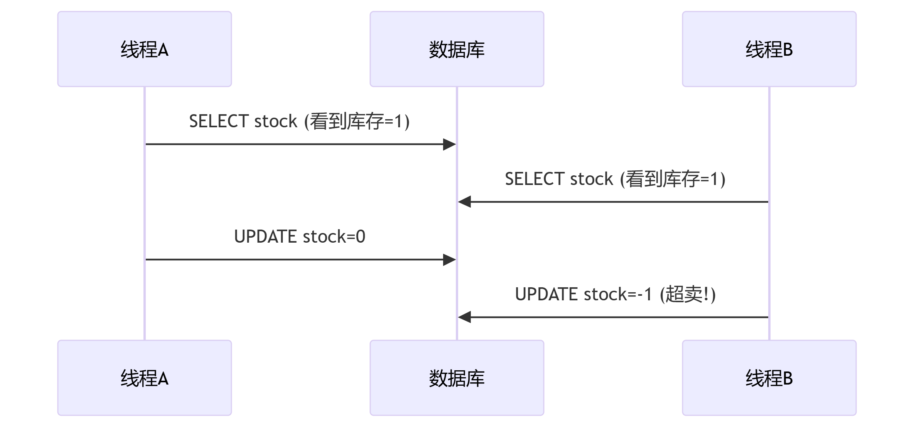
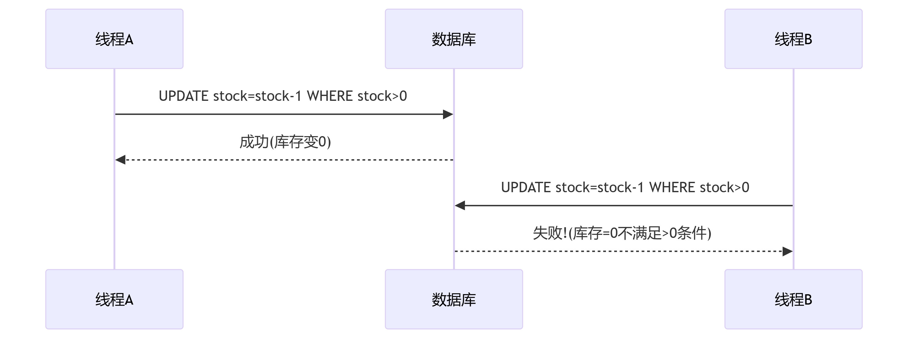

### 悲观锁的问题


### 乐观锁的解决方案


### 关键差异点

| 维度         | 悲观锁方案                     | 您的乐观锁方案                  |
|--------------|-------------------------------|--------------------------------|
| **操作步骤** | 1. 查询库存<br>2. 计算新值<br>3. 更新库存 | 单条原子UPDATE语句              |
| **并发风险** | 查询和更新之间存在时间差        | 条件检查和更新是原子操作         |
| **锁机制**   | 需要显式加锁(SELECT FOR UPDATE) | 数据库内部行锁(自动、瞬时)       |
| **库存保护** | 依赖开发人员正确加锁            | 数据库引擎保证                  |
| **性能影响** | 长时间锁表                     | 微秒级锁定                     |

### 为什么SQL语句是原子的？

1. **数据库内部机制**：
   ```sql
   UPDATE tb_seckill_voucher 
   SET stock = stock - 1 
   WHERE voucher_id = ? AND stock > 0
   ```
    - 执行时数据库会自动对该行加**排他锁(X锁)**
    - 锁定时间 = 执行时间(通常<1ms)

2. **操作不可分割**：
    - 检查stock > 0
    - 执行stock - 1
    - 写入新值
      这三个动作在数据库内部是**不可分割的原子操作**

3. **排队执行保障**：
    - 当100个并发请求同时执行该语句
    - 数据库会让它们排队执行（不是同时）
    - 每个请求都会检查**当前最新**的库存值

### 实际执行过程模拟

假设库存初始为1，两个并发请求：

```
时间点 | 线程A操作                           | 线程B操作                           | 实际库存
-----------------------------------------------------------------------------------------
 t1   | 开始执行UPDATE...WHERE stock>0      | 等待中                             | 1
 t2   | 数据库加锁(行锁)                    | 继续等待                           | 1
 t3   | 检查：1>0 → 通过                    | 继续等待                           | 1
 t4   | 计算：1-1=0                        | 继续等待                           | 1
 t5   | 写入新值0                          | 继续等待                           | 0
 t6   | 释放锁                             | 获得锁                             | 0
 t7   |                                   | 检查：0>0 → 失败！                | 0
 t8   |                                   | 放弃更新                           | 0
```

### 为什么不会出现负库存？

关键在这行代码：
```go
if result.RowsAffected == 0 {
    return ErrStockNotEnough // 库存不足时直接返回错误
}
```
- 当更新影响行数为0时，表示WHERE条件不满足
- 即：stock <= 0 时更新操作不会执行
- 因此数据库中的stock永远不会小于0

### 总结

> 通过`UPDATE ... WHERE stock > 0`这种单语句操作，利用数据库的原子性保证，在**执行更新的瞬间**完成库存检查和扣减，消除了查询和更新之间的时间差，从根本上避免了超卖问题，这就是乐观锁的精髓。

在高并发场景下既保证了数据一致性，又获得了接近无锁的性能表现，是秒杀系统的理想解决方案。