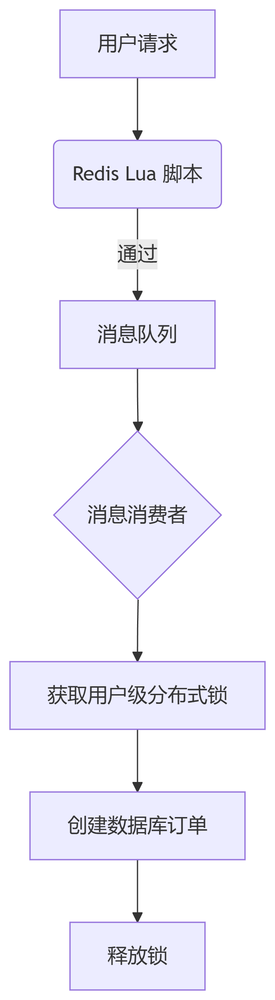

在优惠券秒杀功能的代码中，虽然使用了 Redis + Lua 脚本进行库存和一单校验，但后续仍然需要分布式锁的原因在于解决**异步处理阶段的并发安全问题**。以下是详细分析：

### 1. **Redis Lua 脚本的作用（预校验阶段）**
```lua
-- 伪代码逻辑
if 库存 <= 0 then return 1 end
if 用户已购买 then return 2 end
扣减库存
记录用户购买
发送订单消息到流(stream.orders)
```
- ✅ **原子性保证**：Lua 脚本在 Redis 中原子执行，确保库存扣减和用户记录的原子操作。
- ✅ **快速拦截**：在请求入口层拦截超卖和重复购买（如库存不足或用户重复购买直接返回错误）。

### 2. **为什么需要分布式锁（异步处理阶段）**
在消息处理函数 `processVoucherMessage()` 中：
```go
func processVoucherMessage(msg redisConfig.XMessage) error {
    // 解析消息
    lock.LockWithWatchDog(lockKey) // 分布式锁
    createVoucherOrder(order)     // 创建数据库订单
    lock.UnlockWithWatchDog()
}
```
**必要性分析**：
1. **消息积压导致并发问题**：
    - 即使 Lua 脚本通过，同一个用户可能因快速重试生成**多条消息**（例如网络抖动时用户多次点击）。
    - 消息队列可能积压同一用户的多个消息，导致多个消费者并发处理。

2. **数据库层面的最终一致性**：
    - `createVoucherOrder()` 中的检查是**数据库查询**，非原子操作：
      ```go
      // 非原子检查！高并发下可能同时通过检查
      purchased, _ := HasPurchasedVoucher(userId, voucherId)
      if purchased { ... }
      ```
    - 事务隔离级别（如 MySQL 的 RR/RC）无法完全防止并发插入。

3. **幂等性保障**：
    - 消息可能重复消费（如 Pending List 重试机制），需确保订单创建操作的幂等性。

### 3. **分布式锁的核心价值**
```go
lockKey := fmt.Sprintf("lock:order:%d", order.UserId)
```
- **粒度控制**：以 `UserID` 为锁粒度，确保同一用户的所有订单创建请求串行化。
- **关键保护点**：
    - 防数据库重复插入（唯一索引是兜底，但锁减少数据库压力）
    - 防消息重复消费导致的订单重复

### 4. **流程对比**



### 5. **优化建议**
1. **唯一索引兜底**：  
   在 `tb_voucher_order` 表增加唯一索引：
   ```sql
   UNIQUE KEY uniq_user_voucher (user_id, voucher_id)
   ```
    - 即使锁失效，数据库仍能阻止重复订单。

2. **锁粒度细化**：  
   当前锁覆盖整个订单创建过程，可考虑优化：
   ```go
   // 伪代码：缩小锁范围
   if !checkOrderExists(userId, voucherId) { // 快速检查
       lock.Lock()
       createOrder() // 包含最终检查
       lock.Unlock()
   }
   ```

### 总结
| 阶段         | 技术               | 解决的问题                  | 必要性               |
|--------------|--------------------|---------------------------|---------------------|
| 请求入口     | Redis + Lua        | 原子扣减库存/拦截重复请求   | 必须，第一道防线     |
| 异步处理     | 分布式锁           | 防数据库并发插入/消息幂等   | 必须，第二道防线     |

**结论**：分布式锁在异步处理阶段是必要的，它解决了消息并发消费和数据库非原子操作的并发安全问题，与 Lua 脚本共同构成完整的防护体系。